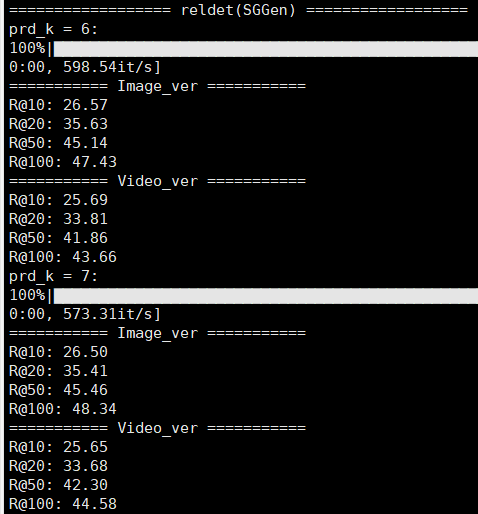

# Target Adaptive Context Aggregation for Video Scene Graph Generation

This is a PyTorch implementation for [Target Adaptive Context Aggregation for Video Scene Graph Generation](https://arxiv.org/abs/2108.08121). 

## Requirements
- PyTorch >= 1.2 (Mine 1.7.1 (CUDA 10.1))
- torchvision >= 0.4 (Mine 0.8.2 (CUDA 10.1))
- cython
- matplotlib
- numpy
- scipy
- opencv
- pyyaml
- packaging
- [pycocotools](https://github.com/cocodataset/cocoapi)
- tensorboardX
- tqdm
- pillow
- scikit-image
- h5py
- yacs
- ninja
- overrides
- mmcv

### Compilation
Compile the CUDA code in the Detectron submodule and in the repo:
```
# ROOT=path/to/cloned/repository
cd $ROOT/Detectron_pytorch/lib
sh make.sh
cd $ROOT/lib
sh make.sh
```

## Data Preparation

### Download Datasets

Download links: [VidVRD](https://xdshang.github.io/docs/imagenet-vidvrd.html) and [AG](https://www.actiongenome.org/#download). 

Create directories for datasets. The directories for `./data/` should look like:

```
|-- data
|   |-- ag
|   |-- vidvrd
|   |-- obj_embed
```

where `ag` and `vidvrd` are for AG and VidVRD datasets, and `obj_embed` is for [GloVe](https://nlp.stanford.edu/projects/glove/), the weights of pre-trained word vectors. The final directories for [GloVe](https://nlp.stanford.edu/projects/glove/) should look like:

```
|-- obj_embed
|   |-- glove.6B.200d.pt
|   |-- glove.6B.300d.pt
|   |-- glove.6B.300d.txt
|   |-- glove.6B.200d.txt
|   |-- glove.6B.100d.txt
|   |-- glove.6B.50d.txt
|   |-- glove.6B.300d
```

#### AG

Put the .mp4 files into `./data/ag/videos/`. Put the [annotations](https://drive.google.com/drive/folders/1LGGPK_QgGbh9gH9SDFv_9LIhBliZbZys?usp=sharing) into `./data/ag/annotations/`.

The final directories for VidVRD dataset should look like:

```
|-- ag
|   |-- annotations
|   |   |-- object_classes.txt
|   |   |-- ...
|   |-- videos
|   |   |-- ....mp4
|   |-- Charades_annotations
```

#### VidVRD
Put the .mp4 files into `./data/vidvrd/videos/`. Put the three documents `test`, `train` and `videos` from the [vidvrd-annoataions](https://zdtnag7mmr.larksuite.com/file/boxuseoWLGxId1KmbtQyxj8HPre) into `./data/vidvrd/annotations/`. (If the links are invalid, you can refer to their offical website: [ImageNet-VidVRD dataset](https://xdshang.github.io/docs/imagenet-vidvrd.html))

Download precomputed precomputed features, model and detected relations from [here](https://internal-api-drive-stream.larksuite.com/space/api/box/stream/download/all/boxusS8Z0kwEizoPPh5h7vx7Usf/) (or [here](https://drive.google.com/drive/folders/1DRy5OXhvv36SWKHFcW6GAX69nbwPkYRN?usp=sharing)). Extract `features` and `models` into `./data/vidvrd/`.

The final directories for VidVRD dataset should look like:

```
|-- vidvrd
|   |-- annotations
|   |   |-- test
|   |   |-- train
|   |   |-- videos
|   |   |-- predicate.txt
|   |   |-- object.txt
|   |   |-- ...
|   |-- features
|   |   |-- relation
|   |   |-- traj_cls
|   |   |-- traj_cls_gt
|   |-- models
|   |   |-- baseline_setting.json
|   |   |-- ...
|   |-- videos
|   |   |-- ILSVRC2015_train_00005003.mp4
|   |   |-- ...
```

### Change the format of annotations for AG and VidVRD

```
# ROOT=path/to/cloned/repository
cd $ROOT

python tools/rename_ag.py

python tools/rename_vidvrd_anno.py

python tools/get_vidvrd_pretrained_rois.py --out_rpath pre_processed_boxes_gt_dense_more --rpath traj_cls_gt

python tools/get_vidvrd_pretrained_rois.py --out_rpath pre_processed_boxes_dense_more
```

### Dump  frames

Our ffmpeg version is 4.2.2-0york0~16.04 so using `--ignore_editlist` to avoid some frames being ignored. The jpg format saves the drive space.

Dump the annotated frames for AG and VidVRD.

```
python tools/dump_frames.py --ignore_editlist

python tools/dump_frames.py --ignore_editlist --video_dir data/vidvrd/videos --frame_dir data/vidvrd/frames --frame_list_file val_fname_list.json,train_fname_list.json --annotation_dir data/vidvrd/annotations --st_id 0
```

Dump the sampled high quality frames for AG and VidVRD.

```
python tools/dump_frames.py --frame_dir data/ag/sampled_frames --ignore_editlist --frames_store_type jpg --high_quality --sampled_frames

python tools/dump_frames.py --ignore_editlist --video_dir data/vidvrd/videos --frame_dir data/vidvrd/sampled_frames --frame_list_file val_fname_list.json,train_fname_list.json --annotation_dir data/vidvrd/annotations --frames_store_type jpg --high_quality --sampled_frames --st_id 0
```

If you want to dump all frames with jpg format. 

```
python tools/dump_frames.py --all_frames --frame_dir data/ag/all_frames --ignore_editlist --frames_store_type jpg
```

### Get classes in json format for AG

``` 
# ROOT=path/to/cloned/repository
cd $ROOT
python txt2json.py
```

### Get Charades train/test split for AG

Download [Charades annotations](https://ai2-public-datasets.s3-us-west-2.amazonaws.com/charades/Charades.zip) and extract the annotations into `./data/ag/Charades_annotations/`. Then run,

```
# ROOT=path/to/cloned/repository
cd $ROOT
python tools/dataset_split.py
```


## Pretrained Models

Download model weights from [here](https://drive.google.com/drive/folders/1eaJPaB4SAXubPXXmMXSAIQAPIRhdb1Ho?usp=sharing).

- pretrained object detection
- TRACE trained on VidVRD in  `detection_models/vidvrd/trained_rel`
- TRACE trained on AG in `detection_models/ag/trained_rel` 

## Performance

VidVrd, gt box

| Method  | mAP | Recall@50 | Recall@100 |
| :-------: | :------: | :------: | :-------: |
| TRACE |      30.6      |   19.3   |   24.6   |


VidVrd, detected box

| Method  | mAP | Recall@50 | Recall@100 |
| :-------: | :------: | :------: | :-------: |
| TRACE |      16.3      |   9.2   |   11.2   |


AG, detected box



## Training Relationship Detection Models

### VidVRD

```bash
# ROOT=path/to/cloned/repository
cd $ROOT

CUDA_VISIBLE_DEVICES=0 python tools/train_net_step_rel.py --dataset vidvrd --cfg configs/vidvrd/vidvrd_res101xi3d50_all_boxes_sample_train_flip_dc5_2d_new.yaml --nw 8 --use_tfboard --disp_interval 20 --o SGD --lr 0.025
```

### AG

```bash
# ROOT=path/to/cloned/repository
cd $ROOT

CUDA_VISIBLE_DEVICES=0 python tools/train_net_step_rel.py --dataset ag --cfg configs/ag/res101xi3d50_dc5_2d.yaml --nw 8 --use_tfboard --disp_interval 20 --o SGD --lr 0.01
```

## Evaluating Relationship Detection Models

### VidVRD

evaluation for gt boxes

```bash
CUDA_VISIBLE_DEVICES=1,2,3,4,5,6,7 python tools/test_net_rel.py --dataset vidvrd --cfg configs/vidvrd/vidvrd_res101xi3d50_gt_boxes_dc5_2d_new.yaml --load_ckpt Outputs/vidvrd_res101xi3d50_all_boxes_sample_train_flip_dc5_2d_new/Aug01-16-20-06_gpuserver-11_step_with_prd_cls_v3/ckpt/model_step12999.pth --output_dir Outputs/vidvrd_new101 --do_val --multi-gpu-testing

python tools/transform_vidvrd_results.py --input_dir Outputs/vidvrd_new101 --output_dir Outputs/vidvrd_new101 --is_gt_traj

python tools/test_vidvrd.py --prediction Outputs/vidvrd_new101/baseline_relation_prediction.json --groundtruth data/vidvrd/annotations/test_gt.json
```

evaluation for detected boxes

```bash
CUDA_VISIBLE_DEVICES=1 python tools/test_net_rel.py --dataset vidvrd --cfg configs/vidvrd/vidvrd_res101xi3d50_pred_boxes_flip_dc5_2d_new.yaml --load_ckpt Outputs/vidvrd_res101xi3d50_all_boxes_sample_train_flip_dc5_2d_new/Aug01-16-20-06_gpuserver-11_step_with_prd_cls_v3/ckpt/model_step12999.pth --output_dir Outputs/vidvrd_new101_det2 --do_val

python tools/transform_vidvrd_results.py --input_dir Outputs/vidvrd_new101_det2 --output_dir Outputs/vidvrd_new101_det2

python tools/test_vidvrd.py --prediction Outputs/vidvrd_new101_det2/baseline_relation_prediction.json --groundtruth data/vidvrd/annotations/test_gt.json


```
### AG

evaluation for detected boxes, Recalls  (SGDet)

```bash
CUDA_VISIBLE_DEVICES=4 python tools/test_net_rel.py --dataset ag --cfg configs/ag/res101xi3d50_dc5_2d.yaml --load_ckpt Outputs/res101xi3d50_dc5_2d/Nov01-21-50-49_gpuserver-11_step_with_prd_cls_v3/ckpt/model_step177329.pth --output_dir Outputs/ag_val_101_ag_dc5_jin_map_new_infer_multiatten --do_val

#evaluation for detected boxes, mRecalls
python tools/visualize.py  --output_dir Outputs/ag_val_101_ag_dc5_jin_map_new_infer_multiatten --num 60000 --no_do_vis --rel_class_recall
```

evaluation for detected boxes, mAP_{rel}

```bash
CUDA_VISIBLE_DEVICES=4 python tools/test_net_rel.py --dataset ag --cfg configs/ag/res101xi3d50_dc5_2d.yaml --load_ckpt Outputs/res101xi3d50_dc5_2d/Nov01-21-50-49_gpuserver-11_step_with_prd_cls_v3/ckpt/model_step177329.pth --output_dir Outputs/ag_val_101_ag_dc5_jin_map_new_infer_multiatten --do_val --eva_map --topk 50
```

evaluation for gt boxes, Recalls (SGCls)

```bash
CUDA_VISIBLE_DEVICES=4 python tools/test_net_rel.py --dataset ag --cfg configs/ag/res101xi3d50_dc5_2d.yaml --load_ckpt Outputs/res101xi3d50_dc5_2d/Nov01-21-50-49_gpuserver-11_step_with_prd_cls_v3/ckpt/model_step177329.pth --output_dir Outputs/ag_val_101_ag_dc5_jin_map_new_infer_multiatten --do_val --use_gt_boxes

#evaluation for detected boxes, mRecalls
python tools/visualize.py  --output_dir Outputs/ag_val_101_ag_dc5_jin_map_new_infer_multiatten --num 60000 --no_do_vis --rel_class_recall
```

evaluation for gt boxes, gt object labels, Recalls (PredCls)

```bash
CUDA_VISIBLE_DEVICES=4 python tools/test_net_rel.py --dataset ag --cfg configs/ag/res101xi3d50_dc5_2d.yaml --load_ckpt Outputs/res101xi3d50_dc5_2d/Nov01-21-50-49_gpuserver-11_step_with_prd_cls_v3/ckpt/model_step177329.pth --output_dir Outputs/ag_val_101_ag_dc5_jin_map_new_infer_multiatten --do_val --use_gt_boxes --use_gt_labels

#evaluation for detected boxes, mRecalls
python tools/visualize.py  --output_dir Outputs/ag_val_101_ag_dc5_jin_map_new_infer_multiatten --num 60000 --no_do_vis --rel_class_recall
```

## Hint
- We apply the dilation convolution in I3D now, but observe a gridding effect in temporal feature maps.


## Acknowledgements

This project is built on top of [ContrastiveLosses4VRD](https://github.com/NVIDIA/ContrastiveLosses4VRD),  [ActionGenome](https://github.com/JingweiJ/ActionGenome) and [VidVRD-helper](https://github.com/xdshang/VidVRD-helper). The corresponding papers are [Graphical Contrastive Losses for Scene Graph Parsing](https://arxiv.org/abs/1903.02728),  [Action Genome: Actions as Compositions of Spatio-temporal Scene Graphs](https://arxiv.org/pdf/1912.06992.pdf) and [Video Visual Relation Detection](https://magus.ink/homepage_static/paper/mm17-shangxd.pdf).


## Citing
If you use this code in your research, please use the following BibTeX entry.
```
@inproceedings{Target_Adaptive_Context_Aggregation_for_Video_Scene_Graph_Generation,
  author    = {Yao Teng and
               Limin Wang and
               Zhifeng Li and
               Gangshan Wu},
  title     = {Target Adaptive Context Aggregation for Video Scene Graph Generation},
  booktitle = {Proceedings of the IEEE/CVF International Conference on Computer Vision},
  pages     = {13688--13697},
  year      = {2021}
}
```

